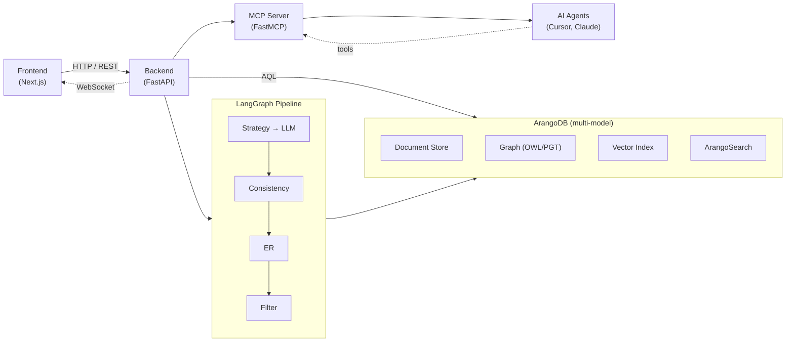

# Arango-OntoExtract (AOE)

LLM-driven ontology extraction and curation platform built on ArangoDB.

AOE ingests unstructured documents (PDF, DOCX, Markdown), extracts formal domain ontologies via large language models, and provides a visual curation dashboard for domain experts to review, edit, and promote extracted knowledge into a production graph. Ontologies are stored in ArangoDB via ArangoRDF's PGT transformation, preserving OWL metamodel semantics while leveraging ArangoDB's multi-model capabilities.


> The AOE workspace: asset explorer (left), graph canvas with the active lens legend, floating class detail panel, and VCR timeline for temporal navigation — all on one persistent stage.

## Architecture



**Two-tier ontology model:**

- **Tier 1 — Domain Ontologies:** Standardized industry schemas (shared across organizations)
- **Tier 2 — Localized Extensions:** Organization-specific sub-graphs linked to Tier 1 via `rdfs:subClassOf`

## Quick Start

```bash
# 1. Clone and set up
git clone <repo-url> && cd arango-ontoextract
cp .env.example .env          # Add your API keys
make setup                     # Python venv + npm install

# 2. Start infrastructure
make infra                     # ArangoDB + Redis via Docker

# 3. Run the backend
make backend                   # FastAPI on :8000
```

After startup:

| Service | URL |
|---------|-----|
| Backend API | http://localhost:8000 |
| API Docs (Swagger) | http://localhost:8000/docs |
| Frontend | http://localhost:3000 |
| ArangoDB UI | http://localhost:8529 |

## Features

| Feature | Status | Description |
|---------|--------|-------------|
| Document Ingestion | Done | Upload PDF/DOCX/Markdown → parse → chunk → embed |
| LLM Extraction | Done | N-pass extraction with self-correction via LangGraph |
| Visual Curation | Done | React Flow graph canvas with approve/reject/edit/merge |
| VCR Timeline | Done | Temporal time travel with point-in-time snapshots |
| Entity Resolution | Partial | Blocking/scoring implemented; full pipeline in progress |
| Cross-Tier ER | Partial | Find overlaps between local and domain ontologies |
| Staging → Production | Done | Promote approved entities with temporal versioning |
| Import/Export | Done | OWL/TTL import and TTL/JSON-LD/CSV export |
| MCP Server | Done | 18 tools for AI agent integration (stdio + SSE) |
| Pipeline Monitor | Done | Real-time Agent DAG with WebSocket events |
| ArangoDB Visualizer | Done | Custom themes, canvas actions, saved queries |
| Auth (JWT + RBAC) | Done | 4 roles, org-scoped, API key auth for MCP |
| Notifications | Done | In-app notification queue with WebSocket |
| Observability | Done | Structured logging, Prometheus metrics, OpenTelemetry |

## Project Structure

```
arango-ontoextract/
├── backend/                       # Python / FastAPI
│   ├── app/
│   │   ├── api/                   # REST endpoints (documents, extraction, ontology, curation, er)
│   │   ├── db/                    # ArangoDB repositories and client
│   │   ├── extraction/            # LangGraph pipeline, agents, prompts
│   │   │   ├── agents/            # Strategy, extractor, consistency, ER, filter
│   │   │   ├── prompts/           # Per-domain prompt templates (Tier 1, Tier 2)
│   │   │   ├── pipeline.py        # StateGraph definition
│   │   │   └── state.py           # Pipeline state schema
│   │   ├── models/                # Pydantic models (documents, ontology, curation)
│   │   ├── services/              # Business logic (ingestion, extraction, curation, temporal, ER)
│   │   ├── mcp/                   # MCP server (tools, resources, auth)
│   │   ├── config.py              # Settings from environment
│   │   └── main.py                # FastAPI app entry point
│   ├── migrations/                # Versioned database migrations
│   ├── tests/
│   │   ├── unit/                  # Mocked, fast tests
│   │   ├── integration/           # Real ArangoDB via Docker
│   │   ├── e2e/                   # Full workflow tests
│   │   └── fixtures/              # LLM responses, sample docs, ontologies
│   └── pyproject.toml
├── frontend/                      # React / Next.js
│   ├── src/
│   │   ├── app/                   # App router pages (pipeline, curation, library)
│   │   ├── components/            # Graph canvas, VCR timeline, curation panels
│   │   └── lib/                   # API client, WebSocket hooks, auth
│   └── package.json
├── scripts/
│   └── setup/                     # Visualizer install script
├── docs/
│   ├── user-guide.md              # Comprehensive user walkthrough
│   ├── architecture.md            # System architecture overview
│   ├── api-reference.md           # Full API endpoint catalog
│   ├── benchmarks.md              # Performance targets
│   ├── mcp-server.md              # MCP tool catalog and connection guide
│   ├── adr/                       # Architecture Decision Records
│   └── visualizer/                # ArangoDB Graph Visualizer customizations
├── .env.example                   # Environment variable template
├── docker-compose.yml             # ArangoDB + Redis (dev)
├── docker-compose.test.yml        # Ephemeral test services
├── docker-compose.prod.yml        # Production profile with TLS
├── Makefile                       # Dev commands
└── PRD.md                         # Product requirements document
```

## Development Commands

```bash
make help              # List all commands

# Setup
make setup             # First-time setup (venv + deps + .env)

# Infrastructure
make infra             # Start ArangoDB + Redis
make infra-down        # Stop infrastructure
make infra-reset       # Stop and delete volumes

# Run
make backend           # Backend dev server (hot-reload, port 8000)
make frontend          # Frontend dev server (port 3000)
make migrate           # Apply pending database migrations

# Quality
make test              # Run all backend tests
make test-unit         # Run unit tests only
make test-integration  # Run integration tests (requires Docker)
make test-all          # Unit + integration tests
make lint              # Lint backend (ruff + mypy)
make format            # Auto-format backend code
make typecheck         # Type-check backend
make type-check        # Type-check backend + frontend

# Test Infrastructure
make test-infra-up     # Start test ArangoDB + Redis
make test-infra-down   # Stop test containers

# Cleanup
make clean             # Remove caches and build artifacts
```

## API Endpoints

### System

| Method | Path | Description |
|--------|------|-------------|
| `GET` | `/health` | Health check |
| `GET` | `/ready` | Readiness probe |

### Documents

| Method | Path | Description |
|--------|------|-------------|
| `POST` | `/api/v1/documents/upload` | Upload a document |
| `GET` | `/api/v1/documents` | List documents |
| `GET` | `/api/v1/documents/{doc_id}` | Get document status |
| `GET` | `/api/v1/documents/{doc_id}/chunks` | List chunks |
| `DELETE` | `/api/v1/documents/{doc_id}` | Soft-delete document |

### Extraction

| Method | Path | Description |
|--------|------|-------------|
| `POST` | `/api/v1/extraction/run` | Trigger extraction |
| `GET` | `/api/v1/extraction/runs` | List runs |
| `GET` | `/api/v1/extraction/runs/{run_id}` | Run status |
| `GET` | `/api/v1/extraction/runs/{run_id}/steps` | Agent step details |
| `GET` | `/api/v1/extraction/runs/{run_id}/results` | Extracted entities |
| `POST` | `/api/v1/extraction/runs/{run_id}/retry` | Retry failed run |
| `GET` | `/api/v1/extraction/runs/{run_id}/cost` | LLM cost breakdown |

### Ontology

| Method | Path | Description |
|--------|------|-------------|
| `GET` | `/api/v1/ontology/library` | List ontologies |
| `GET` | `/api/v1/ontology/library/{id}` | Ontology detail + stats |
| `PUT` | `/api/v1/ontology/library/{id}` | Update registry metadata (name, description, tags, tier, status) |
| `PUT` | `/api/v1/ontology/orgs/{org_id}/ontologies` | Set base ontologies |
| `GET` | `/api/v1/ontology/orgs/{org_id}/ontologies` | Get base ontologies |
| `GET` | `/api/v1/ontology/domain` | Domain ontology graph |
| `GET` | `/api/v1/ontology/staging/{run_id}` | Staging graph |
| `POST` | `/api/v1/ontology/staging/{run_id}/promote` | Promote staging |
| `GET` | `/api/v1/ontology/{id}/snapshot` | Point-in-time snapshot |
| `GET` | `/api/v1/ontology/class/{key}/history` | Version history |
| `GET` | `/api/v1/ontology/{id}/diff` | Temporal diff |
| `GET` | `/api/v1/ontology/{id}/timeline` | Timeline events |
| `POST` | `/api/v1/ontology/class/{key}/revert` | Revert to version |
| `POST` | `/api/v1/ontology/import` | Import OWL/TTL (query: `ontology_id`, optional `ontology_label`) |
| `GET` | `/api/v1/ontology/{id}/export` | Export ontology (formats: `turtle`, `jsonld`, `csv`) |

### Curation

| Method | Path | Description |
|--------|------|-------------|
| `POST` | `/api/v1/curation/decide` | Record curation decision |
| `POST` | `/api/v1/curation/batch` | Batch decisions |
| `GET` | `/api/v1/curation/decisions` | List decisions |
| `GET` | `/api/v1/curation/decisions/{id}` | Get decision |
| `POST` | `/api/v1/curation/merge` | Merge entities |
| `POST` | `/api/v1/curation/promote/{run_id}` | Promote to production |
| `GET` | `/api/v1/curation/promote/{run_id}/status` | Promotion status |

### Entity Resolution

| Method | Path | Description |
|--------|------|-------------|
| `POST` | `/api/v1/er/run` | Trigger ER pipeline |
| `GET` | `/api/v1/er/runs/{run_id}` | ER run status |
| `GET` | `/api/v1/er/runs/{run_id}/candidates` | Merge candidates |
| `GET` | `/api/v1/er/runs/{run_id}/clusters` | Entity clusters |
| `POST` | `/api/v1/er/explain` | Explain match |
| `POST` | `/api/v1/er/merge` | Execute merge |
| `POST` | `/api/v1/er/cross-tier` | Cross-tier candidates |
| `GET` | `/api/v1/er/config` | Get ER config |
| `PUT` | `/api/v1/er/config` | Update ER config |

### Quality

| Method | Path | Description |
|--------|------|-------------|
| `GET` | `/api/v1/quality/dashboard` | Summary + per-ontology scorecards + alerts |
| `GET` | `/api/v1/quality/{ontology_id}` | Merged structural + extraction quality for one ontology |
| `GET` | `/api/v1/quality/{ontology_id}/evaluation` | Strengths / weaknesses text |
| `GET` | `/api/v1/quality/{ontology_id}/class-scores` | Per-class faithfulness / validity for charts |

### WebSocket

| Path | Description |
|------|-------------|
| `ws://host/ws/extraction/{run_id}` | Extraction pipeline progress |

Full interactive docs at `/docs`. Full static reference: [docs/api-reference.md](docs/api-reference.md).

## MCP Tools

The AOE MCP server exposes 18 tools to AI agents. Connect via stdio (Cursor/Claude Desktop) or SSE (custom clients).

| Tool | Description |
|------|-------------|
| `query_collections` | List ArangoDB collections |
| `run_aql` | Execute read-only AQL |
| `sample_collection` | Sample documents |
| `query_domain_ontology` | Ontology summary |
| `get_class_hierarchy` | SubClassOf tree |
| `get_class_properties` | Class properties |
| `search_similar_classes` | BM25 search |
| `trigger_extraction` | Start extraction |
| `get_extraction_status` | Run status |
| `get_merge_candidates` | ER candidates |
| `get_ontology_snapshot` | Point-in-time graph |
| `get_class_history` | Version history |
| `get_ontology_diff` | Temporal diff |
| `get_provenance` | Entity provenance |
| `export_ontology` | Export OWL/TTL |
| `run_entity_resolution` | Trigger ER |
| `explain_entity_match` | Match details |
| `get_entity_clusters` | WCC clusters |

See [docs/mcp-server.md](docs/mcp-server.md) for connection instructions and full tool catalog.

## Testing

```bash
# Unit tests (mocked, fast)
make test-unit

# Integration tests (requires Docker ArangoDB)
make test-infra-up
make test-integration
make test-infra-down

# All tests
make test-all

# Frontend tests
cd frontend && npm test          # Jest
cd frontend && npx playwright test  # E2E
```

Coverage targets: ≥ 80% overall, ≥ 90% for services/db, ≥ 85% for API routes.

## Configuration

All configuration is via environment variables (see [.env.example](.env.example)):

| Variable | Default | Description |
|----------|---------|-------------|
| `ARANGO_HOST` | `http://localhost:8529` | ArangoDB connection URL |
| `ARANGO_DB` | `OntoExtract` | Database name |
| `ANTHROPIC_API_KEY` | — | Anthropic API key for Claude |
| `OPENAI_API_KEY` | — | OpenAI API key for embeddings |
| `LLM_EXTRACTION_MODEL` | `claude-sonnet-4-20250514` | Model for ontology extraction |
| `EXTRACTION_PASSES` | `3` | Number of LLM passes for consistency |
| `ER_VECTOR_SIMILARITY_THRESHOLD` | `0.85` | Min similarity for merge candidates |
| `TEST_DEPLOYMENT_MODE` | `local_docker` | Deployment mode (local_docker, self_managed_platform, managed_platform) |

## Deployment

### Local Docker (Development)

```bash
make infra      # ArangoDB + Redis
make backend    # FastAPI dev server
make frontend   # Next.js dev server
```

### Docker Compose (Production)

```bash
docker compose -f docker-compose.prod.yml up -d
```

The production Compose profile runs Caddy as the edge reverse proxy/TLS terminator,
with backend, frontend, ArangoDB, Redis, and the optional MCP server behind it.

### Bring Your Own Container

The application containers run without a separate web-server sidecar or
in-container reverse proxy. Build `backend/Dockerfile` for the FastAPI API and
`frontend/Dockerfile` for the Next.js standalone server. Redis is used by the
backend for rate limiting and best-effort notification Pub/Sub; ArangoDB remains
the primary persistence layer.

Kubernetes manifests under `k8s/` are deployment examples. Set
`ingressClassName` and any controller-specific ingress annotations in your
target platform rather than treating them as application dependencies.

### Container Images

| Image | Base | Size Target |
|-------|------|-------------|
| `aoe-backend` | `python:3.11-slim` | < 500 MB |
| `aoe-frontend` | `node:20-alpine` (Next.js standalone) | < 100 MB |
| `aoe-mcp-server` | `python:3.11-slim` | < 400 MB |

## Documentation

| Document | Description |
|----------|-------------|
| [PRD.md](PRD.md) | Full product requirements |
| [docs/user-guide.md](docs/user-guide.md) | User walkthrough |
| [docs/architecture.md](docs/architecture.md) | System architecture |
| [docs/api-reference.md](docs/api-reference.md) | API endpoint catalog |
| [docs/mcp-server.md](docs/mcp-server.md) | MCP server tool catalog |
| [docs/benchmarks.md](docs/benchmarks.md) | Performance targets |
| [docs/adr/](docs/adr/) | Architecture Decision Records |
| [docs/visualizer/](docs/visualizer/) | ArangoDB Visualizer customizations |
| [samples/corpora/README.md](samples/corpora/README.md) | Synthetic + real test corpora for the extraction pipeline |
| [benchmarks/ontology_extraction/README.md](benchmarks/ontology_extraction/README.md) | Ontology-extraction benchmark harness (Re-DocRED, WebNLG) |

## Contributing

1. Create a feature branch from `main`
2. Follow existing code patterns (see `.cursor/rules/`)
3. Write tests for all changes (unit + integration)
4. Run `make lint` and `make typecheck` before committing
5. Use conventional commit messages: `feat(scope): description`
6. Open a PR with a summary of changes and test plan

## License

Private — all rights reserved.
