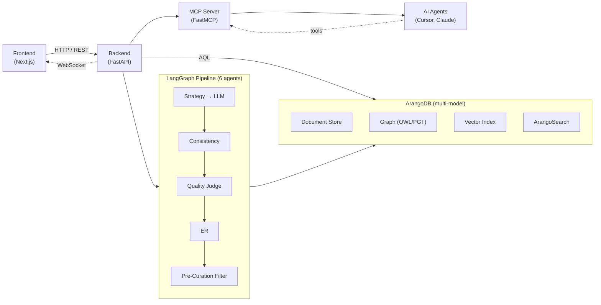

# Arango-OntoExtract (AOE)

LLM-driven ontology extraction and curation platform built on ArangoDB.

AOE ingests unstructured documents (PDF, DOCX, Markdown), extracts formal domain ontologies via large language models, and provides a visual curation dashboard for domain experts to review, edit, and promote extracted knowledge into a production graph. Ontologies are stored in ArangoDB via ArangoRDF's PGT transformation, preserving OWL metamodel semantics while leveraging ArangoDB's multi-model capabilities.


> The AOE workspace: asset explorer (left), graph canvas with the active lens legend, floating class detail panel, and VCR timeline for temporal navigation — all on one persistent stage.

## Architecture



**Two-tier ontology model:**

- **Tier 1 — Domain Ontologies:** Standardized industry schemas (shared across organizations)
- **Tier 2 — Localized Extensions:** Organization-specific sub-graphs linked to Tier 1 via `rdfs:subClassOf`

## Quick Start

> **AOE is a web application, not a CLI or a bare API.** The primary way to
> use it is the **workspace UI at http://localhost:3000**. The `curl` examples
> elsewhere in the docs are for automation and integration — you do **not**
> need them to get started. Follow all six steps below; the app needs a
> **database**, a **backend**, *and* a **frontend** running together.

### Prerequisites

Install these before you start:

| Requirement | Why | Notes |
|-------------|-----|-------|
| **Docker + Docker Compose** | Runs the **ArangoDB** database and Redis locally | **Required** for the default setup. `make infra` starts ArangoDB Community Edition for you — you do not install ArangoDB by hand. (Already have a remote ArangoDB? See [Database: local vs. remote](#database-local-vs-remote).) |
| **Python 3.11+** | Backend (FastAPI) | `python3 --version` |
| **Node.js 18+** | Frontend (Next.js) | `node --version` |
| **Anthropic API key** | LLM extraction | Put in `.env` as `ANTHROPIC_API_KEY` |
| **OpenAI API key** | Embeddings | Put in `.env` as `OPENAI_API_KEY` |

### Run it

```bash
# 1. Clone and configure
git clone <repo-url> && cd arango-ontoextract
cp .env.example .env           # then edit .env: set ANTHROPIC_API_KEY + OPENAI_API_KEY

# 2. Install dependencies (Python venv + npm)
make setup

# 3. Start the database + Redis (requires Docker running)
make infra                     # launches ArangoDB Community Edition + Redis in Docker

# 4. Create the database schema (collections, indexes, graphs)
make migrate

# 5. Start the backend  — leave this running (default port 8010)
make backend
```

```bash
# 6. In a SECOND terminal, start the frontend — leave this running too
make frontend
```

### Open the app

**→ Open http://localhost:3000 in your browser.** That's the AOE workspace —
upload a document, run extraction, and curate the resulting ontology visually.

> **No login needed for local dev.** Local runs bypass authentication and drop
> you straight into the workspace — you should *not* see a sign-in screen. (The
> browser reaches the backend through a built-in `/api` proxy, so you only ever
> open one URL: **http://localhost:3000**.) If you *do* land on a "Sign in" page
> or see **"Login failed (404)"**, see [Troubleshooting](#troubleshooting).

| Surface | URL | What it is |
|---------|-----|------------|
| **Workspace UI** | **http://localhost:3000** | **Start here.** The visual curation app (upload, extract, graph canvas, timeline) |
| API Docs (Swagger) | http://localhost:8010/docs | Interactive REST reference (for automation / integration) |
| Backend API | http://localhost:8010 | FastAPI server the UI talks to |
| ArangoDB Web UI | http://localhost:8530 | Raw database admin (host port; container listens on 8529) |

> Backend port defaults to **8010** so `8000` stays free for other tools;
> override with `BACKEND_PORT=8000` in `.env`.

### Database: local vs. remote

By default AOE runs its own **local ArangoDB Community Edition** in Docker (you
don't install or configure a database by hand — `make infra` does it). If you'd
rather point at an existing ArangoDB cluster or a managed deployment, set
`TEST_DEPLOYMENT_MODE` in `.env` and fill in the matching connection block:

| `TEST_DEPLOYMENT_MODE` | Use when | What to set in `.env` | Run `make infra`? |
|------------------------|----------|------------------------|-------------------|
| `local_docker` *(default)* | Local dev / first run | `ARANGO_HOST`, `ARANGO_DB`, `ARANGO_USER`, `ARANGO_PASSWORD` (defaults work out of the box) | **Yes** — it starts the local DB |
| `self_managed_platform` | Your own remote ArangoDB cluster | Uncomment + set `ARANGO_ENDPOINT`, `ARANGO_DB`, `ARANGO_USER`, `ARANGO_PASSWORD`, `ARANGO_VERIFY_SSL` | No — skip it; point at your cluster |
| `managed_platform` | ArangoDB Managed Platform (AMP) | Uncomment + set `ARANGO_ENDPOINT`, `ARANGO_GRAPH_API_KEY_ID`, `ARANGO_GRAPH_API_KEY_SECRET`, etc. | No — skip it; point at AMP |

In every mode you still run `make migrate` once to create the schema in the
target database. See the annotated connection blocks in
[.env.example](.env.example) for the exact variables.

## Troubleshooting

Most first-run issues come from one of two things: a server that isn't running,
or an `.env` change that hasn't been picked up yet.

> **The #1 gotcha:** after you edit `.env`, you must **restart** the affected
> server. `.env` is read only when a server *starts* — saving the file does not
> update an already-running `make backend` or `make frontend`. Stop it with
> `Ctrl+C` in its terminal and run the command again.

| Symptom | Likely cause | Fix |
|---------|--------------|-----|
| You see a **"Sign in"** screen, or upload/login shows **"Login failed (404)"** | The frontend can't reach the backend, or it was started before the backend was ready | 1) Make sure the backend is running: open http://localhost:8010/health — it should say `{"status":"ok"}`. If not, run `make backend`. 2) In the frontend terminal, stop it (`Ctrl+C`) and run `make frontend` again. Local dev bypasses login, so you should land straight in the workspace. |
| Upload fails with **"Incorrect API key provided"** / `invalid_api_key` (401) | `OPENAI_API_KEY` in `.env` is missing, mistyped, or revoked | Set a valid key (from https://platform.openai.com/account/api-keys) as `OPENAI_API_KEY` in `.env`, then **restart `make backend`** so it loads the new key. |
| Upload fails mentioning **Anthropic** / extraction errors | `ANTHROPIC_API_KEY` missing or invalid | Set a valid `ANTHROPIC_API_KEY` in `.env`, then **restart `make backend`**. |
| `make infra` / `make migrate` errors about connection refused | Docker isn't running, or the database hasn't finished starting | Start Docker Desktop, run `make infra`, wait ~10s for ArangoDB to become healthy, then `make migrate`. |
| Port already in use on `8010` or `3000` | Another app (or a previous run) is using the port | Stop the other process, or change `BACKEND_PORT` in `.env` (the frontend proxy follows it via `BACKEND_PROXY_URL`). |

Still stuck? The backend prints structured logs in its terminal — the last few
lines usually name the exact failing step.

## Using the Workspace UI

AOE is designed to be driven from the **`/workspace`** page — one persistent
"stage" where you stay on the graph and act on objects (classes, edges,
documents, ontologies, runs) through **right-click context menus**. You rarely
need the API for day-to-day work.


A typical first session, entirely in the browser at **http://localhost:3000**:

1. **Upload a document** — drag a PDF, DOCX, PPTX, or Markdown file into the
   asset explorer. AOE parses, chunks, and embeds it automatically.
2. **Extract an ontology** — drag the document onto the canvas (or right-click →
   *Extract*) to run the LLM pipeline. Watch progress live on the pipeline DAG.
3. **Curate visually** — left-click any class/edge/property to open its detail
   panel; right-click to **Approve / Reject / Edit / View provenance**. Switch
   *lenses* (1–5) to recolor the graph by confidence, tier, or status.
4. **Travel through time** — scrub the **VCR timeline** at the bottom to see the
   ontology at any past point, diff two versions, or revert a class.
5. **Promote to production** — once approved, promote entities into the
   production graph with full temporal versioning.

> **Interaction contract:** *left-click selects* (safe, read-only),
> *right-click acts* (the menus are where the actions live). If you're ever
> unsure what to do, **right-click** the canvas or any entity.

For a step-by-step walkthrough with every panel and shortcut explained, see the
[User Guide](docs/user-guide.md). Prefer to automate instead? The same
operations are available over REST — see [API Endpoints](#api-endpoints) and the
live Swagger docs at http://localhost:8010/docs.

> 📸 **Want to help?** More annotated UI screenshots make this section far more
> inviting to new users. If you'd like to contribute them, see the shot list in
> [`docs/images/README.md`](docs/images/README.md).

## Features

| Feature | Status | Description |
|---------|--------|-------------|
| Document Ingestion | Done | Upload PDF/DOCX/Markdown → parse → chunk → embed |
| LLM Extraction | Done | N-pass extraction with self-correction via LangGraph |
| Visual Curation | Done | Object-centric `/workspace` canvas (Sigma.js + box-arrow UML view) with context-menu actions, lenses, and floating detail panels |
| VCR Timeline | Done | Temporal time travel with point-in-time snapshots |
| Entity Resolution | Partial | Hand-rolled blocking/scoring + workspace **Find Duplicates…** overlay; full `arango-entity-resolution` library integration deferred |
| Cross-Tier ER | Partial | Find overlaps between local and domain ontologies |
| Staging → Production | Done | Promote approved entities with temporal versioning |
| Import/Export | Done | OWL/TTL import and TTL/JSON-LD/CSV export |
| MCP Server | Done | 18 tools for AI agent integration (stdio + SSE) |
| Pipeline Monitor | Done | Real-time Agent DAG with WebSocket events |
| ArangoDB Visualizer | Done | Custom themes, canvas actions, saved queries |
| Auth (JWT + RBAC) | Done | 4 roles, org-scoped, API key auth for MCP |
| Notifications | Done | In-app notification queue with WebSocket |
| Observability | Done | Structured logging (`structlog`), Prometheus metrics (`/api/v1/metrics`), OpenTelemetry tracing (default-off; flip `OTEL_ENABLED=true` + point at an OTLP collector), production alert rules in `infra/monitoring/alerts.yml` for extraction failure rate / API p95 / queue depth / DB connectivity. See [docs/operations/production-deployment.md](docs/operations/production-deployment.md). |

## Project Structure

```
arango-ontoextract/
├── backend/                       # Python / FastAPI
│   ├── app/
│   │   ├── api/                   # REST endpoints (documents, extraction, ontology, curation, er)
│   │   ├── db/                    # ArangoDB repositories and client
│   │   ├── extraction/            # LangGraph pipeline, agents, prompts
│   │   │   ├── agents/            # Strategy, extractor, consistency, ER, filter
│   │   │   ├── prompts/           # Per-domain prompt templates (Tier 1, Tier 2)
│   │   │   ├── pipeline.py        # StateGraph definition
│   │   │   └── state.py           # Pipeline state schema
│   │   ├── models/                # Pydantic models (documents, ontology, curation)
│   │   ├── services/              # Business logic (ingestion, extraction, curation, temporal, ER)
│   │   ├── mcp/                   # MCP server (tools, resources, auth)
│   │   ├── config.py              # Settings from environment
│   │   └── main.py                # FastAPI app entry point
│   ├── migrations/                # Versioned database migrations
│   ├── tests/
│   │   ├── unit/                  # Mocked, fast tests
│   │   ├── integration/           # Real ArangoDB via Docker
│   │   ├── e2e/                   # Full workflow tests
│   │   └── fixtures/              # LLM responses, sample docs, ontologies
│   └── pyproject.toml
├── frontend/                      # React / Next.js
│   ├── src/
│   │   ├── app/                   # App router pages (pipeline, curation, library)
│   │   ├── components/            # Graph canvas, VCR timeline, curation panels
│   │   └── lib/                   # API client, WebSocket hooks, auth
│   └── package.json
├── scripts/
│   └── setup/                     # Visualizer install script
├── docs/
│   ├── user-guide.md              # Comprehensive user walkthrough
│   ├── architecture.md            # System architecture overview
│   ├── api-reference.md           # Full API endpoint catalog
│   ├── benchmarks.md              # Performance targets
│   ├── mcp-server.md              # MCP tool catalog and connection guide
│   ├── adr/                       # Architecture Decision Records
│   └── visualizer/                # ArangoDB Graph Visualizer customizations
├── .env.example                   # Environment variable template
├── docker-compose.yml             # ArangoDB + Redis (dev)
├── docker-compose.test.yml        # Ephemeral test services
├── docker-compose.prod.yml        # Production profile with TLS
├── Makefile                       # Dev commands
└── PRD.md                         # Product requirements document
```

## Development Commands

```bash
make help              # List all commands

# Setup
make setup             # First-time setup (venv + deps + .env)

# Infrastructure
make infra             # Start ArangoDB + Redis
make infra-down        # Stop infrastructure
make infra-reset       # Stop and delete volumes

# Run
make backend           # Backend dev server (hot-reload, default port 8010)
make frontend          # Frontend dev server (port 3000)
make migrate           # Apply pending database migrations

# Quality
make test              # Run all backend tests
make test-unit         # Run unit tests only
make test-integration  # Run integration tests (requires Docker)
make test-all          # Unit + integration tests
make lint              # Lint backend (ruff + mypy)
make format            # Auto-format backend code
make typecheck         # Type-check backend
make type-check        # Type-check backend + frontend

# Test Infrastructure
make test-infra-up     # Start test ArangoDB + Redis
make test-infra-down   # Stop test containers

# Cleanup
make clean             # Remove caches and build artifacts
```

## API Endpoints

### System

| Method | Path | Description |
|--------|------|-------------|
| `GET` | `/health` | Health check |
| `GET` | `/ready` | Readiness probe |

### Documents

| Method | Path | Description |
|--------|------|-------------|
| `POST` | `/api/v1/documents/upload` | Upload a document |
| `GET` | `/api/v1/documents` | List documents |
| `GET` | `/api/v1/documents/{doc_id}` | Get document status |
| `GET` | `/api/v1/documents/{doc_id}/chunks` | List chunks |
| `DELETE` | `/api/v1/documents/{doc_id}` | Soft-delete document |

### Extraction

| Method | Path | Description |
|--------|------|-------------|
| `POST` | `/api/v1/extraction/run` | Trigger extraction |
| `GET` | `/api/v1/extraction/runs` | List runs |
| `GET` | `/api/v1/extraction/runs/{run_id}` | Run status |
| `GET` | `/api/v1/extraction/runs/{run_id}/steps` | Agent step details |
| `GET` | `/api/v1/extraction/runs/{run_id}/results` | Extracted entities |
| `POST` | `/api/v1/extraction/runs/{run_id}/retry` | Retry failed run |
| `GET` | `/api/v1/extraction/runs/{run_id}/cost` | LLM cost breakdown |

### Ontology

| Method | Path | Description |
|--------|------|-------------|
| `GET` | `/api/v1/ontology/library` | List ontologies |
| `GET` | `/api/v1/ontology/library/{id}` | Ontology detail + stats |
| `PUT` | `/api/v1/ontology/library/{id}` | Update registry metadata (name, description, tags, tier, status) |
| `PUT` | `/api/v1/ontology/orgs/{org_id}/ontologies` | Set base ontologies |
| `GET` | `/api/v1/ontology/orgs/{org_id}/ontologies` | Get base ontologies |
| `GET` | `/api/v1/ontology/domain` | Domain ontology graph |
| `GET` | `/api/v1/ontology/staging/{run_id}` | Staging graph |
| `POST` | `/api/v1/ontology/staging/{run_id}/promote` | Promote staging |
| `GET` | `/api/v1/ontology/{id}/snapshot` | Point-in-time snapshot |
| `GET` | `/api/v1/ontology/class/{key}/history` | Version history |
| `GET` | `/api/v1/ontology/{id}/diff` | Temporal diff |
| `GET` | `/api/v1/ontology/{id}/timeline` | Timeline events |
| `POST` | `/api/v1/ontology/class/{key}/revert` | Revert to version |
| `POST` | `/api/v1/ontology/import` | Import OWL/TTL (query: `ontology_id`, optional `ontology_label`) |
| `GET` | `/api/v1/ontology/{id}/export` | Export ontology (formats: `turtle`, `jsonld`, `csv`) |

### Curation

| Method | Path | Description |
|--------|------|-------------|
| `POST` | `/api/v1/curation/decide` | Record curation decision |
| `POST` | `/api/v1/curation/batch` | Batch decisions |
| `GET` | `/api/v1/curation/decisions` | List decisions |
| `GET` | `/api/v1/curation/decisions/{id}` | Get decision |
| `POST` | `/api/v1/curation/merge` | Merge entities |
| `POST` | `/api/v1/curation/promote/{run_id}` | Promote to production |
| `GET` | `/api/v1/curation/promote/{run_id}/status` | Promotion status |

### Entity Resolution

| Method | Path | Description |
|--------|------|-------------|
| `POST` | `/api/v1/er/run` | Trigger ER pipeline |
| `GET` | `/api/v1/er/runs/{run_id}` | ER run status |
| `GET` | `/api/v1/er/runs/{run_id}/candidates` | Merge candidates |
| `GET` | `/api/v1/er/runs/{run_id}/clusters` | Entity clusters |
| `POST` | `/api/v1/er/explain` | Explain match |
| `POST` | `/api/v1/er/merge` | Execute merge |
| `POST` | `/api/v1/er/cross-tier` | Cross-tier candidates |
| `GET` | `/api/v1/er/config` | Get ER config |
| `PUT` | `/api/v1/er/config` | Update ER config |

### Quality

| Method | Path | Description |
|--------|------|-------------|
| `GET` | `/api/v1/quality/dashboard` | Summary + per-ontology scorecards + alerts |
| `GET` | `/api/v1/quality/{ontology_id}` | Merged structural + extraction quality for one ontology |
| `GET` | `/api/v1/quality/{ontology_id}/evaluation` | Strengths / weaknesses text |
| `GET` | `/api/v1/quality/{ontology_id}/class-scores` | Per-class faithfulness / validity for charts |

### WebSocket

| Path | Description |
|------|-------------|
| `ws://host/ws/extraction/{run_id}` | Extraction pipeline progress |

Full interactive docs at `/docs`. Full static reference: [docs/api-reference.md](docs/api-reference.md).

## MCP Tools

The AOE MCP server exposes 18 tools to AI agents. Connect via stdio (Cursor/Claude Desktop) or SSE (custom clients).

| Tool | Description |
|------|-------------|
| `query_collections` | List ArangoDB collections |
| `run_aql` | Execute read-only AQL |
| `sample_collection` | Sample documents |
| `query_domain_ontology` | Ontology summary |
| `get_class_hierarchy` | SubClassOf tree |
| `get_class_properties` | Class properties |
| `search_similar_classes` | BM25 search |
| `trigger_extraction` | Start extraction |
| `get_extraction_status` | Run status |
| `get_merge_candidates` | ER candidates |
| `get_ontology_snapshot` | Point-in-time graph |
| `get_class_history` | Version history |
| `get_ontology_diff` | Temporal diff |
| `get_provenance` | Entity provenance |
| `export_ontology` | Export OWL/TTL |
| `run_entity_resolution` | Trigger ER |
| `explain_entity_match` | Match details |
| `get_entity_clusters` | WCC clusters |

See [docs/mcp-server.md](docs/mcp-server.md) for connection instructions and full tool catalog.

## Testing

```bash
# Unit tests (mocked, fast)
make test-unit

# Integration tests (requires Docker ArangoDB)
make test-infra-up
make test-integration
make test-infra-down

# All tests
make test-all

# Frontend tests
cd frontend && npm test          # Jest
cd frontend && npx playwright test  # E2E
```

Coverage targets: ≥ 80% overall, ≥ 90% for services/db, ≥ 85% for API routes.

## Configuration

All configuration is via environment variables (see [.env.example](.env.example)):

| Variable | Default | Description |
|----------|---------|-------------|
| `ARANGO_HOST` | `http://localhost:8530` | ArangoDB connection URL (matches the host-side port mapping in `docker-compose.yml`) |
| `ARANGO_DB` | `OntoExtract` | Database name |
| `ANTHROPIC_API_KEY` | — | Anthropic API key for Claude |
| `OPENAI_API_KEY` | — | OpenAI API key for embeddings |
| `LLM_EXTRACTION_MODEL` | `claude-sonnet-4-20250514` | Model for ontology extraction |
| `EXTRACTION_PASSES` | `3` | Number of LLM passes for consistency |
| `ER_VECTOR_SIMILARITY_THRESHOLD` | `0.85` | Min similarity for merge candidates |
| `TEST_DEPLOYMENT_MODE` | `local_docker` | Deployment mode (local_docker, self_managed_platform, managed_platform) |
| `TEMPORAL_RETENTION_SECONDS` | `7776000` (90 days) | Retention window for expired temporal versions before TTL GC removes them. Set `0` to disable (history accumulates forever — dev / forensic only). |
| `OTEL_ENABLED` | `false` | Enable OpenTelemetry tracing. When on, the backend ships spans for ingest → extraction → materialize → graph-creation. |
| `OTEL_EXPORTER_OTLP_ENDPOINT` | _(empty)_ | OTLP/gRPC endpoint (eg `http://otel-collector:4317`). Empty + `OTEL_ENABLED=true` falls back to a stdout console exporter for local-dev smoke. |
| `OTEL_TRACE_SAMPLE_RATE` | `1.0` | Root-span sample rate (clamped to `[0, 1]`). Use `0.1` for high-traffic prod to keep collector cost bounded. |

## Deployment

### Local Docker (Development)

```bash
make infra      # ArangoDB + Redis
make backend    # FastAPI dev server
make frontend   # Next.js dev server
```

### Docker Compose (Production)

```bash
# Core stack: caddy + backend + frontend + arangodb + redis
docker compose -f docker-compose.prod.yml up -d

# Optional MCP server
docker compose -f docker-compose.prod.yml --profile mcp up -d

# Optional monitoring stack: Prometheus + Alertmanager
docker compose -f docker-compose.prod.yml --profile monitoring up -d
```

The production Compose profile runs Caddy as the edge reverse proxy/TLS terminator,
with backend, frontend, ArangoDB, Redis, and the optional MCP server behind it.
Every service has `deploy.resources.limits` + `reservations` plus
`json-file` log rotation (10MB × 5 files). See
[docs/operations/production-deployment.md](docs/operations/production-deployment.md)
for the full operations runbook (topology, resource sizing, metrics endpoint
reference, per-alert remediation steps, Alertmanager customisation, backup/restore).

### Bring Your Own Container

The application containers run without a separate web-server sidecar or
in-container reverse proxy. Build `backend/Dockerfile` for the FastAPI API and
`frontend/Dockerfile` for the Next.js standalone server. Redis is used by the
backend for rate limiting and best-effort notification Pub/Sub; ArangoDB remains
the primary persistence layer.

Kubernetes manifests under `k8s/` are deployment examples. Set
`ingressClassName` and any controller-specific ingress annotations in your
target platform rather than treating them as application dependencies.

### Container Images

| Image | Base | Size Target |
|-------|------|-------------|
| `aoe-backend` | `python:3.11-slim` | < 500 MB |
| `aoe-frontend` | `node:20-alpine` (Next.js standalone) | < 100 MB |
| `aoe-mcp-server` | `python:3.11-slim` | < 400 MB |

## Documentation

| Document | Description |
|----------|-------------|
| [PRD.md](PRD.md) | Full product requirements |
| [docs/user-guide.md](docs/user-guide.md) | User walkthrough |
| [docs/architecture.md](docs/architecture.md) | System architecture |
| [docs/api-reference.md](docs/api-reference.md) | API endpoint catalog |
| [docs/mcp-server.md](docs/mcp-server.md) | MCP server tool catalog |
| [docs/benchmarks.md](docs/benchmarks.md) | Performance targets + how to run the benchmark harness |
| [docs/operations/production-deployment.md](docs/operations/production-deployment.md) | Production operations runbook (topology, resource limits, monitoring stack, alert remediation, backup/restore) |
| [docs/adr/](docs/adr/) | Architecture Decision Records |
| [docs/visualizer/](docs/visualizer/) | ArangoDB Visualizer customizations |
| [samples/corpora/README.md](samples/corpora/README.md) | Synthetic + real test corpora for the extraction pipeline |
| [benchmarks/operations/README.md](benchmarks/operations/README.md) | Ops benchmarks (API latency, materialization, temporal snapshot) + committed baseline numbers |
| [benchmarks/ontology_extraction/README.md](benchmarks/ontology_extraction/README.md) | Ontology-extraction quality benchmarks (Re-DocRED, WebNLG) |

## Contributing

Bug reports, questions, documentation fixes, and code contributions
are all welcome — including from people whose primary skill isn't
programming. See [`CONTRIBUTING.md`](CONTRIBUTING.md) for the full
guide; the short version:

- **Report a bug or ask a question** → file an issue on
  [GitHub](https://github.com/arango-solutions/arango-ontoextract/issues).
- **Submit a fix or feature** → open an issue first so we can
  confirm scope, then branch from `main`, follow the conventions
  in [`.cursor/rules/`](.cursor/rules/), add tests
  (`make test-unit` must pass), and open a PR using conventional-
  commit format (`feat(scope): …` / `fix(scope): …`).
- **Improve the docs** → PRs against `docs/` and `README.md` are
  reviewed on the same path as code.

The project is currently distributed under a private,
all-rights-reserved license (see [License](#license)); please open
an issue before investing time in a substantial code contribution.

## License

Private — all rights reserved.
