# Turning Documents and Databases into Living Ontologies: Inside Arango-OntoExtract

*How we built an LLM-driven ontology platform with configurable human oversight — from expert sign-off to agent-reviewed auto-release — on a multi-model database, and why "extract once" is the wrong mental model.*

> **Draft v1** — a first pass for a Medium long-read. Concept figures are Mermaid diagrams (render natively on GitHub and most Markdown import tools); product figures are `` **screenshot placeholders** — drop the PNGs into `docs/images/` (capture checklist in `docs/images/README.md`). Each placeholder carries a hidden `CAPTURE:` comment telling you what to grab. Delete any placeholders you don't use before publishing. Section lengths are tuned for a 5–10 page read.

---

## 1. The problem: knowledge is trapped in prose and schemas

Every organization sits on two giant piles of latent structure.

The first pile is **documents** — PDFs, slide decks, Word files, wikis. They describe how a business actually thinks: its concepts, its taxonomies, its rules. But that knowledge is locked in prose and diagrams. You can search it; you can't *reason* over it.

The second pile is **databases** — the relational tables and graph collections that already encode a working model of the domain, but only *physically*. A `customers` table and a `places_order` foreign key clearly imply concepts and relationships, yet nothing in the database says "a Customer is a kind of Party" or "an Order must have at least one line item."

A **formal ontology** — classes, properties, hierarchies, and constraints expressed in OWL 2 / RDFS — is the bridge between those piles and machine reasoning. The catch: authoring ontologies by hand is slow, expensive, and requires rare expertise. And once authored, they rot, because the documents and databases they were derived from keep changing.

**Arango-OntoExtract (AOE)** is our answer to that catch. It uses large language models to *propose* ontologies from unstructured documents and from live database schemas, then puts a domain expert in the loop to curate them — all on top of a single multi-model database that stores the documents, the graph, the vectors, and the search index together.

This article walks through how it works, the architectural decisions that mattered, and the idea that shaped everything: an ontology is not a build artifact you produce once. It's a **living knowledge graph** that gets revised, time-travelled, and self-repaired.

*The Arango-OntoExtract workspace — a single stage where documents become a curated, navigable ontology.*
<!-- CAPTURE: Hero shot. /workspace with a visually rich demo ontology loaded. Show explorer (left), Sigma.js graph (center, nicely laid out), VCR timeline (bottom). Wide/landscape ~1600px. Avocado-green theme. Redact any org/prospect names. -->

---

## 2. The core idea: a two-tier ontology library

The first design decision was refusing to treat every extracted ontology as an island.

AOE organizes knowledge into **two tiers**:

- **Tier 1 — the Domain Ontology Library.** Standardized, reusable schemas extracted from industry-standard documents (ISO, W3C, NIST, and the like). Curated once, shared across organizations.
- **Tier 2 — Localized Ontologies.** Each organization's own concepts, which *extend* Tier 1 rather than copying it.

The critical property is that Tier 2 is **structurally linked** to Tier 1 using standard OWL/RDFS constructs — `rdfs:subClassOf`, `owl:equivalentClass`, `owl:imports` — not forks or duplicates. A bank's "Retail Mortgage" class is a subclass of the shared "Loan Product" class; it inherits its semantics instead of redefining them.

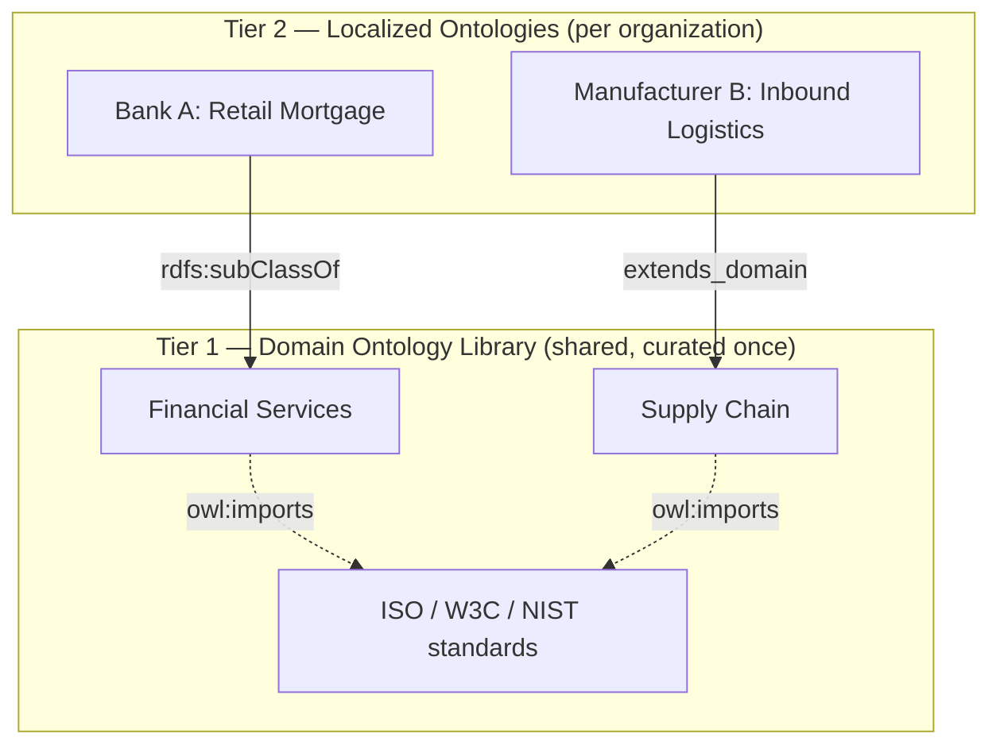

*Figure 1 — The two-tier model. Localized ontologies extend a shared domain library through standard OWL constructs, never copies.*

*Screenshot — the imports-dependency overlay: a localized ontology and the domain ontologies it extends, as real edges.*
<!-- CAPTURE: Workspace "Manage Imports" / imports-graph DAG overlay showing a composed ontology importing 1-2 others. Landscape. -->

This is what makes the library *compose* rather than sprawl. Cross-tier links are first-class edges in the graph, so "show me every local class that specializes this domain concept" is a one-hop traversal.

---

## 3. The system at a glance

AOE is three layers: a Next.js workspace, a Python/FastAPI backend with an agentic orchestration layer, and a multi-model ArangoDB instance underneath. AI agents can also drive the whole thing through the Model Context Protocol (MCP).

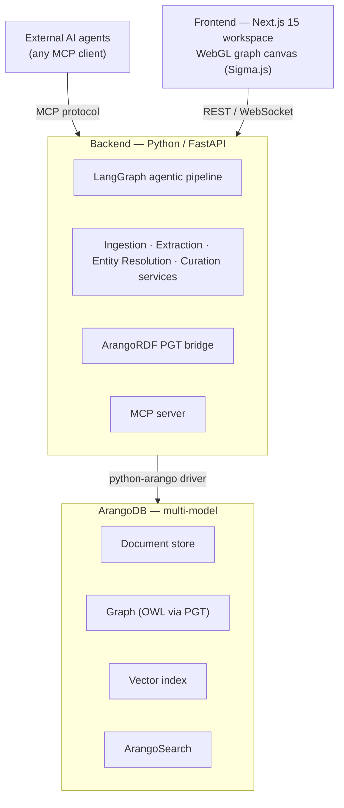

*Figure 2 — High-level architecture. One database engine holds documents, the OWL graph, vectors, and search; the backend orchestrates LLM agents; the frontend is a single persistent workspace.*

A few choices in that diagram are load-bearing:

- **ArangoDB as the single store.** Document + graph + vector + search in one engine means chunk embeddings, the ontology graph, and full-text search live side by side. No syncing three databases.
- **ArangoRDF's PGT transformation.** OWL/RDFS is imported into ArangoDB via Property Graph Transformation (PGT), which preserves the OWL metamodel (class hierarchy, property domains/ranges, restrictions) while still being a native, queryable property graph.
- **LangGraph for orchestration.** Extraction isn't a single prompt; it's a stateful, multi-agent pipeline with retries, parallel branches, and a human-in-the-loop breakpoint. LangGraph models that as a compiled state machine.

---

## 4. The extraction pipeline: agents, not a prompt

The heart of AOE is a LangGraph `StateGraph` that turns a pile of document chunks into a reviewable ontology. It is deliberately *not* "send the document to an LLM and parse the JSON." It's a sequence of specialized agents, each doing one job, with the graph handling retries, a parallel fork, and a curation pause.

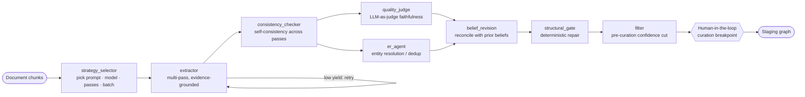

*Figure 3 — The LangGraph extraction pipeline. After consistency checking, quality judging and entity resolution run in parallel, then results are reconciled, structurally repaired, filtered, and paused for human curation before anything is staged.*

*Screenshot — the Pipeline Monitor running a real extraction: each agent's status plus live tokens, cost, confidence, and agreement.*
<!-- CAPTURE: Select a Run in the workspace → pipeline DAG canvas mid- or post-run. Show node statuses (done/running/skipped) and the metrics panel (tokens, cost, entities, confidence, completeness, agreement). Landscape ~1400px. -->

Walking the nodes:

1. **strategy_selector** classifies the document (technical, narrative, tabular, visual-heavy) and chooses the prompt template, model, number of passes, and batch size. A dense slide deck and a long narrative spec should not be extracted the same way.
2. **extractor** runs the LLM in multiple passes, emitting OWL constructs constrained by a strict Pydantic schema. Crucially, every class, parent link, and relationship carries **evidence** — the source chunk IDs and quoted text that justify it. If yield is suspiciously low, the graph loops back and retries.
3. **consistency_checker** keeps only concepts that appear across enough passes — a cheap, effective hallucination filter.
4. **quality_judge** and **er_agent** fork and run *in parallel*: one scores faithfulness with an LLM-as-judge, the other resolves duplicate entities via weighted similarity and union-find clustering.
5. **belief_revision** reconciles the new extraction against beliefs the ontology already holds (more on this below).
6. **structural_gate** applies deterministic, evidence-anchored repairs *before* anything materializes.
7. **filter** drops low-confidence concepts, then the pipeline **pauses** at a human-in-the-loop breakpoint. Nothing reaches the curated ontology without a person — or an explicit policy — saying yes.

That breakpoint is the philosophical center of the product: **the LLM proposes; the human disposes.**

---

## 5. Ingestion: documents are messier than text

Before extraction can run, a document has to become chunks — and real documents are full of structure and pictures that naïve text extraction throws away.

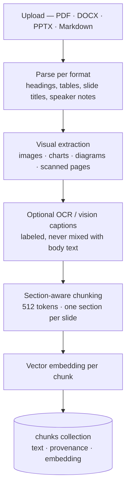

*Figure 4 — Ingestion and chunking. Visual evidence is inventoried (and optionally captioned) so taxonomies encoded in diagrams aren't lost; chunks preserve page/slide provenance.*

*Screenshot — a parsed deck's chunks with `[Visual: slide N]` markers and visual diagnostics: omitted evidence is visible, not silent.*
<!-- CAPTURE: A document's chunk/detail view (a PPTX works best) showing chunk text with a [Visual: slide N ...] marker and the per-doc visual diagnostics counts. -->

Two details matter more than they look:

- **Visual evidence is observable, not silent.** Domain decks frequently encode taxonomies and process flows in *diagrams*, not selectable text. AOE counts and represents every embedded image, chart, and scanned page — even when OCR/vision is disabled — so omitted evidence is *visible* rather than quietly dropped. When configured, an OCR or vision-caption pass appends clearly-labeled visual context (`[Visual: slide 4 image 2] ...`) that the extractor can cite as evidence.
- **Provenance is preserved from the first byte.** Each chunk links back to its document, page/slide number, and section heading. That chain is what later lets a curator click a class and see the exact slide it came from.

---

## 6. Storing OWL in a property graph

Once the LLM produces OWL/Turtle, AOE imports it into ArangoDB via ArangoRDF's PGT transformation and materializes a traversable graph. The result is that ontology semantics become ordinary graph queries.

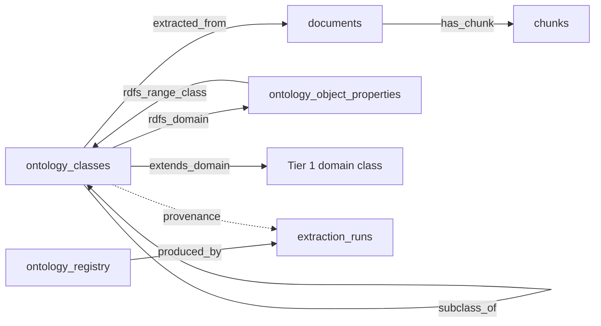

*Figure 5 — The materialized process + ontology graph. Class → property → class traversal, subclass hierarchy, cross-tier extension, and full lineage back to source documents are all native edges.*

*Screenshot — selecting a class opens a read-only detail panel with its quoted evidence text and the exact source chunk/slide it came from.*
<!-- CAPTURE: Left-click a class on the canvas → FloatingDetailPanel. Show label, URI, description, and especially the provenance/evidence section (quoted evidence_text + source chunk ids / slide). -->

This is why "given a class, which document produced it and which chunks contributed?" is a two-hop AQL query rather than a join across systems. The same graph powers the visual canvas, the MCP query tools, and the quality metrics.

---

## 7. Time travel: an ontology has a history

Curated knowledge changes — a class gets renamed, a definition gets refined, a relationship gets retracted. Most systems overwrite. AOE *versions*.

Every versioned vertex and every edge carries a `created` and `expired` interval. "Current" simply means `expired` equals a sentinel (`NEVER_EXPIRES`). Editing a class doesn't destroy the old one; it expires the old version and creates a new one. The entire history is queryable, and the workspace exposes a **VCR-style timeline** to scrub through it.

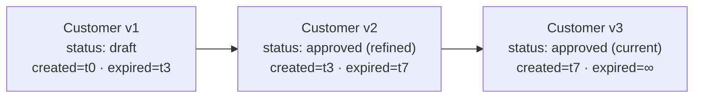

*Figure 6 — Temporal interval versioning. A class is a chain of immutable versions; "now" is the version whose `expired` is the never-expires sentinel. Nothing is ever silently overwritten.*

*Screenshot — the VCR timeline scrubbed back to an earlier event; the canvas re-renders the ontology exactly as it was at that point.*
<!-- CAPTURE: Workspace with an ontology that has history; drag the VCR/timeline slider to a non-latest event and show the canvas reflecting that historical state + the event marker. -->

Time travel isn't a luxury feature here — it's the prerequisite for trusting an *automated* curation system. If an LLM-driven revision goes wrong, you can see exactly what changed, when, and by whom, and revert it.

---

## 8. Belief revision: extraction as an ongoing conversation

Here's where "extract once" breaks down. When you add a second document to an existing ontology, you don't want a fresh, disconnected extraction — you want the new evidence to *update what the ontology already believes*.

AOE treats each existing class, parent link, and relationship as a **belief** with evidence and a confidence score. A new document's extraction is reconciled against those beliefs, and each comparison yields a verdict.

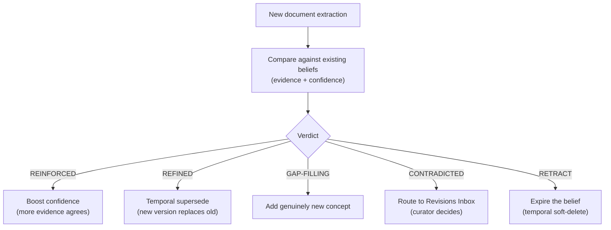

*Figure 7 — Belief revision. Mechanical verdicts handle the easy majority automatically; only genuine contradictions and uncertain cases escalate to a curator's inbox.*

*Screenshot — the Revisions Inbox: a contradiction flagged by a second document, with the agent's justification, awaiting accept / reject / modify.*
<!-- CAPTURE: Open the Revisions Inbox overlay with at least one CONTRADICTED/UNCERTAIN revision; show the detail panel with the revision rationale and accept/reject/modify actions. -->

The pragmatic split is that *mechanical* verdicts — reinforcement, refinement, gap-filling, redundancy — are handled deterministically and cheaply. Only contradictions and uncertain cases invoke an LLM revision agent and surface in a **Revisions Inbox** for a human. Safety guards (published-item protection, a circuit breaker on revision rate, per-org budgets) keep an autonomous reviser from running away. And because everything is temporal, every revision is reversible.

---

## 9. The self-optimizing structural gate

LLM extractions produce a recurring failure mode: a *disconnected* schema. You get dozens of plausible classes, but relationships point at targets that don't quite match any class (a fragment instead of a full URI), and some classes connect to nothing at all.

We borrowed an idea from a self-optimizing-ontology research line: **gate, then repair, before materializing.** A `structural_gate` node sits between belief revision and the curation filter. It computes a pre-materialization health report and applies deterministic, 100%-reliable repairs — *no invention*:

- **URI normalization** — re-point a relationship target that matches a known class only by fragment to its canonical URI.
- **Link recovery** — when a relationship's target resolves to no class, re-point it to the class named in the relationship's *own evidence text*.

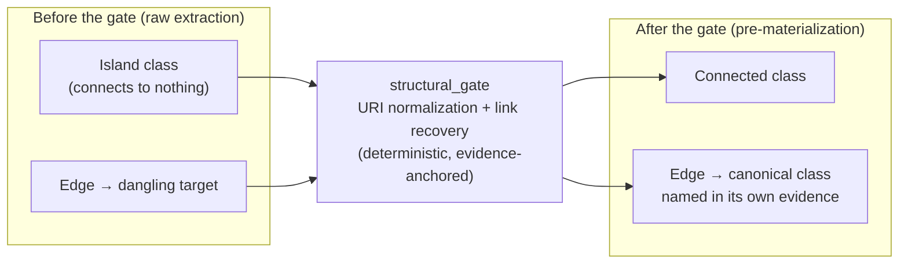

*Figure 8 — The structural gate. Deterministic repairs reconnect the graph before it materializes, without inventing facts the source didn't support.*

The non-negotiable constraint: because the repairs only rewrite relationship *targets* and never touch a class's label, description, or evidence, they **cannot** lower the faithfulness score. That guarantee — proven by a regression test — is exactly what let us turn the gate on by default. The companion post-write metrics (connectivity, structural integrity, isolated-class count, completeness) make the improvement visible in the quality dashboard.

---

## 10. Bootstrapping from a database you already have

Not every ontology should start from documents. If you already run ArangoDB, your *schema* is an ontology waiting to be reverse-engineered. AOE can connect to any ArangoDB instance and walk its named graphs and collections to emit OWL directly.

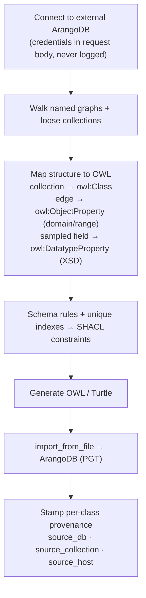

*Figure 9 — Schema extraction from ArangoDB. A named-graph-aware walk produces classes, domain/range-resolved object properties, datatype properties from sampled fields, and SHACL constraints from validation rules and unique indexes — with full provenance back to the source collection.*

*Screenshot — the "Extract from ArangoDB…" overlay: pick which named graphs and collections to include and see the class/property count the extraction will produce, before committing.*
<!-- CAPTURE: Workspace canvas right-click → "Extract from ArangoDB…" → preview step. Show discovered graphs/loose collections with checkboxes and the live "N classes / M object properties" summary line. Redact host/credentials. -->

The roadmap extends this two ways. First, an **optional LLM enrichment layer** runs *on top of* the deterministic extractor (never replacing it) to add human-readable class descriptions and a Markdown "domain description" of the whole schema — so the deterministic structure stays trustworthy while the prose gets richer. Second, the same pattern will apply to **relational databases**: tables become classes, foreign keys become object properties, columns become datatype properties, and constraints become SHACL — pending a clean relational-schema-analyzer library.

---

## 11. The workspace: one stage, not a maze of pages

A tool that produces graphs is only as good as the surface you curate them on. AOE deliberately rejects the "wizard with twelve pages" pattern. The entire experience is **one persistent stage** built around objects, with a single interaction contract.

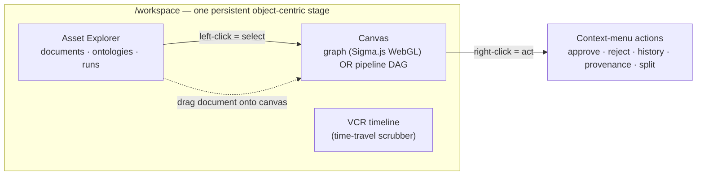

*Figure 10 — The object-centric workspace. Left-click selects and opens a read-only detail panel; right-click acts; drag-and-drop initiates extraction or composition. Swapping what the canvas shows is an object swap, not navigation.*

*Screenshot — the interaction contract in action: right-clicking a class surfaces its actions (approve/reject, view history, provenance, delete) — no separate page required.*
<!-- CAPTURE: Right-click a class node on the canvas to open its context menu; show the action list. Optionally show the lens legend (bottom-left) in the same frame. -->

The rules are strict on purpose: **left-click selects, right-click acts**, and read-only selection is always safe (no "click to delete"). Destructive actions never use native browser dialogs — reversible ones act immediately with an undo toast; irreversible ones use a typed-confirmation overlay. The canvas renders whatever matches the selected object: pick an ontology, you get the graph; pick a run, you get the pipeline DAG. There is no global "edit mode." The WebGL canvas (Sigma.js + graphology) handles large graphs without melting the browser, and lenses repaint attributes onto a *stable* layout rather than re-running it — so changing how you view the graph never disorients you.

---

## 12. Trust, measured: quality metrics

Because the system is automated, it has to be *legible*. AOE scores every extraction along multiple signals and rolls them into an ontology health score (0–100) with a traffic-light display:

- **Faithfulness** — does each class trace to real evidence? (LLM-as-judge.)
- **Semantic validity** — are the assertions internally coherent?
- **Connectivity** and **structural integrity** — is the graph actually a graph, or a bag of islands?
- **Completeness** — how much of the declared structure survived to materialization?
- **Confidence** — a multi-signal score combining evidence age, count, and judge scores.

These aren't vanity numbers. The connectivity and structural-integrity metrics are exactly what the structural gate moves, and faithfulness is the hard cap that any automated repair or revision is forbidden to regress.

*Screenshot — the per-ontology quality view: a six-dimension radar plus the 0–100 health score with a traffic-light indicator.*
<!-- CAPTURE: /workspace or /dashboard per-ontology Quality tab: the recharts radar (faithfulness, semantic validity, connectivity, structural integrity, completeness, confidence) + the health-score card. -->

---

## 13. What's next: documents rarely respect one domain

The most interesting open problem is that real documents — a strategy deck, a regulatory filing — often span *several* domains at once, and a topic can run across multiple slides. Today's pipeline assumes one output ontology per run. The roadmap adds **domain detection**: a pre-extraction step that clusters chunks by topic and decides how to route them.

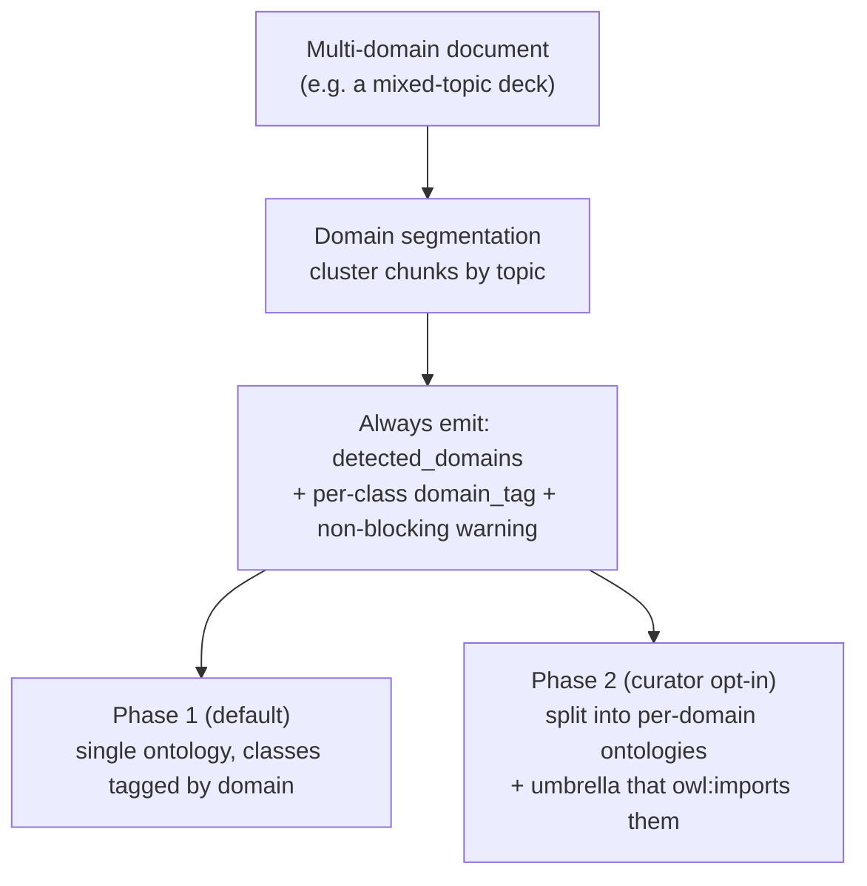

*Figure 11 — Domain detection roadmap. Detection is shared infrastructure; the default keeps everything in one tagged ontology, while a curator can opt into splitting into clean, reusable per-domain ontologies under an umbrella — reusing the imports machinery that already exists.*

Paired with this is **structure-aware chunking**: slide boundaries that are never merged, speaker notes kept distinct, and topics that span slides grouped into a single "topic unit" so the extractor reasons about coherent chunks instead of arbitrary token windows. The unifying insight is that domain splitting and slide grouping are the *same capability at two scales* — segmenting a document into coherent units.

---

## 14. Governing the release: agents that critique before publish

Curation during extraction is one gate. The other — and the one we're building out next — is the **release** boundary. An ontology that downstream systems import via `owl:imports` or query over MCP needs stable, governed versions, and hand-inspecting every concept before each release doesn't scale. So the release boundary gets its own agentic review.

When an engineer cuts a release candidate, AOE runs a **Release Readiness Review** that *composes the signals it already computes* — rule-engine violations (cycles, disjointness, cardinality conflicts), the six quality metrics, gold-standard recall, and the breaking-change report — and adds an LLM critic that turns them into ranked findings: `blocking`, `warning`, or `info`, each with evidence and, where the fix is deterministic, a one-click repair routed through the structural gate.

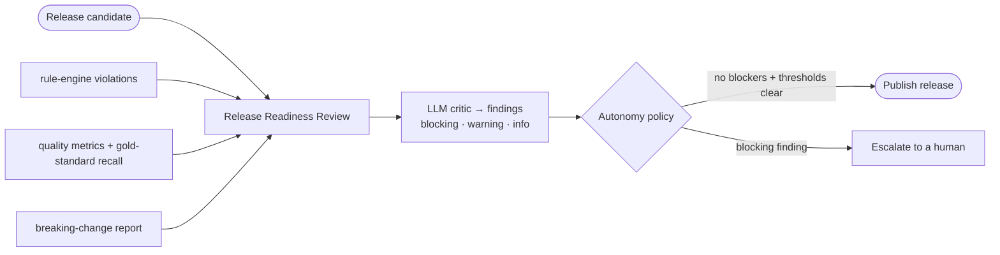

*Figure 12 — Release governance. Deterministic signals plus an LLM critic produce a findings report; a configurable autonomy policy decides whether a clean candidate auto-publishes or escalates to a person.*

The point is that **autonomy is a dial, not a default**:

- **Advisory** — the report informs a human, who publishes. (Default.)
- **Gated-autonomous** — auto-publish only when there are zero blocking findings *and* the metrics clear configured thresholds; otherwise escalate.
- **Supervised-autonomous** — auto-publish and notify, report attached for audit.

Two invariants keep the higher settings honest: **faithfulness is a floor the review can never waive**, and **every release is reversible**. That's the shift from human-*in*-the-loop (a person must touch every item) to human-*on*-the-loop (people set policy and handle the exceptions) — the same move that let CI/CD scale for code.

---

## 15. Closing: ontologies as living systems

The thread running through Arango-OntoExtract is a rejection of the "extract once" mental model. An ontology in AOE is:

- **Proposed** by LLM agents, but **disposed** by humans at an explicit breakpoint.
- **Grounded** in evidence that traces back to specific document chunks or database collections.
- **Versioned** in time, so every change is auditable and reversible.
- **Revised** as new evidence arrives, instead of re-extracted from scratch.
- **Self-repairing** in deterministic, faithfulness-preserving ways before a human ever sees it.
- **Composed** across a shared two-tier library instead of duplicated.

Putting documents, the OWL graph, vectors, and search into one multi-model database is what makes that economical: the provenance chain, the embeddings, and the graph traversals all live in the same engine. The LLMs do the heavy lifting of *proposing* structure; the architecture does the heavier lifting of making that structure *trustworthy enough to keep*.

That's the bet: the future of ontology engineering isn't a better one-shot extractor. It's a living system that proposes, grounds, versions, and revises — with a human holding the pen.

Where we take it next follows the same thread. Domain-aware segmentation and structure-preserving chunking will let a single deck or report fan out into clean, reusable per-domain ontologies under an umbrella, instead of one tangled graph. Relational databases become a first-class source alongside prose, with LLM-enriched descriptions layered additively over the structural extractor rather than replacing it. And as the release-governance signals prove themselves, the autonomy dial turns up — more candidates auto-publishing on policy, fewer waiting on a person — without ever lowering the faithfulness floor or giving up reversibility. The destination is the same: not less human judgment, but human judgment spent where it actually moves the needle.

---

*Want to go deeper? The companion pieces could cover (a) the temporal data model and how `NEVER_EXPIRES` interval semantics power time travel, (b) the LLM-as-judge faithfulness rater and the multi-signal confidence model, or (c) how MCP turns the whole platform into a set of tools any AI agent can call.*
