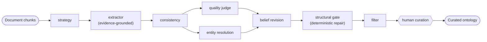

# Arango-OntoExtract: Living Ontologies from Documents and Databases

*An LLM-driven platform that turns prose and schemas into formal, governed knowledge graphs — with configurable autonomy, from agent-reviewed auto-release to expert sign-off — on a single multi-model database.*

**The problem.** Every organization's knowledge is trapped in two places: **documents** (PDFs, decks, specs) that describe how the business thinks, and **databases** whose schemas already encode a working model — but only physically. A formal ontology (OWL 2 / RDFS classes, properties, hierarchies, constraints) is the bridge to machine reasoning, yet authoring one by hand is slow, expensive, and rots the moment the sources change.

**The idea.** Arango-OntoExtract (AOE) uses large language models to *propose* ontologies — from unstructured documents and from live database schemas — then puts a domain expert in the loop to curate them. The guiding principle: an ontology isn't a build artifact you produce once. It's a **living knowledge graph** that gets grounded, versioned, revised, and self-repaired. The LLM proposes; the human disposes.

**How it works.** Documents are parsed (including visual evidence in slides and scans), chunked with provenance, and run through a multi-agent LangGraph pipeline rather than a single prompt:

Every class and relationship carries the **evidence** — the exact source chunks — that justifies it. Quality judging and entity resolution run in parallel, results are reconciled against what the ontology already believes, structurally repaired, then **paused for human review** before anything is committed.

**What makes it different.**

- **Two-tier library.** Localized ontologies *extend* a shared domain library via standard OWL constructs (`rdfs:subClassOf`, `owl:imports`) — links, not copies — so the library composes instead of sprawls.
- **Evidence-grounded.** Click any concept and trace it back to the precise slide or database collection it came from.
- **Time travel.** Every class and edge is temporally versioned; nothing is overwritten, every change is auditable and reversible.
- **Belief revision.** New documents *update* existing beliefs (reinforce, refine, retract) instead of re-extracting from scratch; only genuine contradictions reach a curator's inbox.
- **Self-repairing.** A structural gate reconnects disconnected schemas with deterministic, evidence-anchored fixes that are provably forbidden from lowering faithfulness.
- **Governed release, configurable autonomy.** Agents critique a release candidate (rule-engine violations, quality metrics, an LLM critic) into a readiness report; a per-org policy ranges from advisory sign-off to gated auto-publish — with faithfulness as a non-waivable floor and every release reversible. Human *on* the loop, not stuck *in* it.
- **Bootstrap from a database.** Connect to ArangoDB and reverse-engineer an ontology directly — collections to classes, edges to object properties, constraints to SHACL — with full provenance.
- **One multi-model engine.** Documents, the OWL graph, vector embeddings, and search live together in ArangoDB, so provenance, RAG, and graph traversal share one store. AI agents can drive the whole platform over MCP.

**The bet.** The future of ontology engineering isn't a better one-shot extractor. It's a living system that proposes, grounds, versions, and revises — with a human holding the pen.
